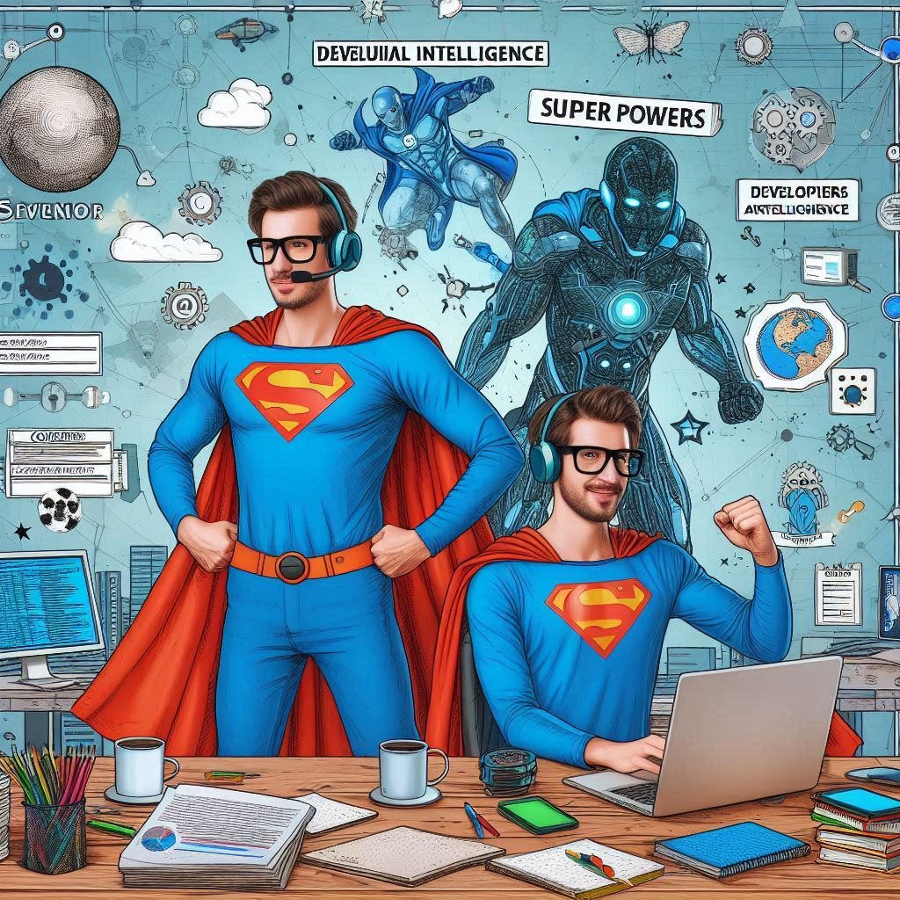

# 👨‍💻 Projeto: Criação de Pôster Utilizando o Copilot IA

 > ℹ️ **NOTE:** Este repositório é um desafio de projeto proposto no curso "Explorando os Recursos de IA Generativa com Copilot e OpenAI" na plataforma da [DIO](https://dio.me).

Projeto de criação de um pôster de um evento de IA proposto como desafio de projeto no Bootcamp Microsoft Copilot IA da plataforma educacional DIO.

Sobre o tema do projeto escolhi fazer um pôster convidando Programadores Juniors a assistirem uma transmissão do evento "IA Fest Dev" no Canal IA Dev no YouTube. 

**Lembrando:** os conteúdos do pôster são fictícios. Este projeto tem como finalidade praticar os conceitos abordados dos cursos realizados no Bootcamp.

## 📖 Preview do Pôster:

## 💻 Tecnologias utilizadas no projeto

- [Copilot Microsoft](https://copilot.microsoft.com/)
- [PowerPoint](https://www.microsoft.com/en/microsoft-365/powerpoint)

## 🧠 Prompts

Copilot Microsot：

|  Ação  | prompt                                                                                 |
| :----: | -------------------------------------------------------------------------------------- |
| Conteúdo Textual | "Crie um pôster para um evento de inteligência artificial que ocorrerá no dia 08-08-2024 às 18 hrs que será transmitido no Youtube pelo canal IA Dev. O tema da live será A utilização de IAs Generativas e Copilots no mundo da programação. O público alvo são programadores juniors. O pôster deverá informar onde será transmitido e a data. Parafrasea uma frase legal sobre Inteligência Artificial. Seja criativo na hora de criar esse pôster, coloque elementos nerds e elementos de IA e deixe o pôster bem chamativo." |
| Imagens | "Crie uma imagem de desenvolvedores usando inteligência artificial com super poderes. O cenário deverá ser nerd e com elementos da cultura nerd e com referência a inteligência artificial." |

## ✨ Features

- Conteúdos textuais e imagens geradas pelo [Copilot IA](https://copilot.microsoft.com/).

## 📚 Materiais

- Prompts utilizados no Copilot em `inputs`;
- Imagens utilizadas em `assets`;
- Pôster gerado em `output`.

## 👨‍💻 Expert

    
    
&nbsp&nbsp&nbspMarcos Winther 
    &nbsp&nbsp&nbsp
    <a href="https://github.com/MarcosWinther">
    GitHub</a>&nbsp;|&nbsp;
    <a href="https://www.linkedin.com/in/marcoswinthersilva/">LinkedIn</a>
    

  

---

⌨️ com 💜 por [Marcos Winther](https://github.com/MarcosWinther)